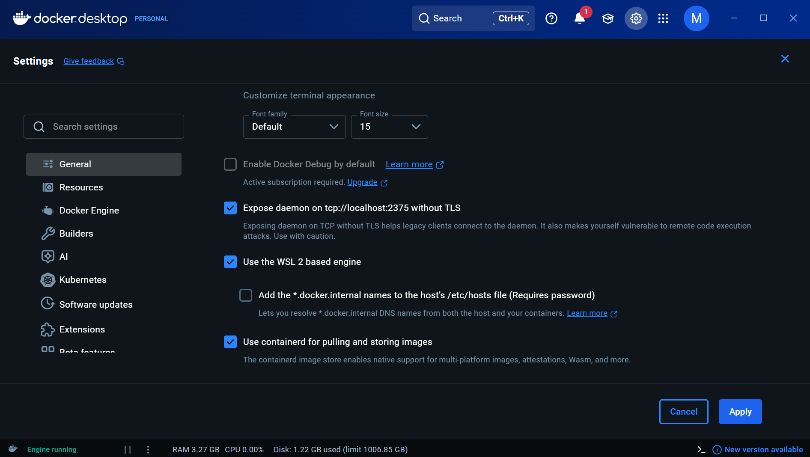
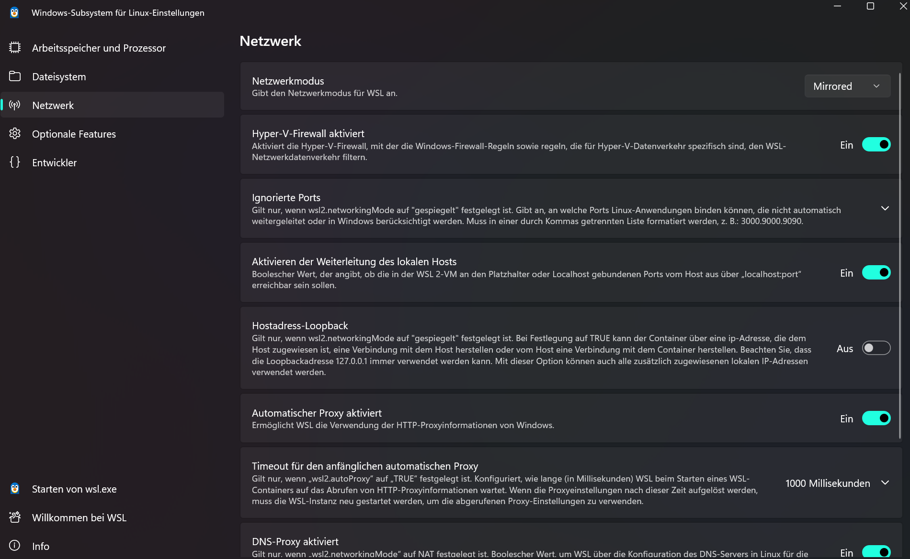

# Kickstart Windows Setup

This document covers
- Setup kickstart develompent environment on Windows10

## Setup Windows 11 workstation

This document assumes you have your project located in drive `C:`.

### Requirements
- Installed [Docker for Windows](https://docs.docker.com/docker-for-windows/install/)
- [Activated Windows Subsystem 2 for Linux (WSL2)](https://learn.microsoft.com/de-de/windows/wsl/install)
    - Upgrade from WSL 1 to 2: `wsl --set-version Ubuntu 2`
- [Installed Ubuntu for Windows](https://ubuntu.com/tutorials/tutorial-ubuntu-on-windows#3-install-ubuntu-for-windows-10)

#### Additional
- [Running Phpstorm "in" WSL2 and starting docker containers](https://github.com/lackovic/notes/tree/master/Windows/Windows%20Subsystem%20for%20Linux#install-intellij-idea)

### Required Options in Docker for Windows
- Open Docker for Windows settings
    - Expose docker deamon
        1. Go to `General` settings
        2. To expose the docker deamon enable the marked option in the picture below and also check the option "Use the WSL based engine"
        
       


- Enable Windows WSL2 Mirrored Networking: (damit Zugriff auf localhost funktioniert)
    - shutdonw current wsl-service using `wsl --shutdown` in the terminal/powershell
    - search for "WSL Settings" in Windows and make sure the Networking mode is set to "mirrored
    
    - Restart the WSL using wsl in the terminal/powershell
    - type 'wslinfo --networking-mode' and make sure the output is "mirrored"
       


### Configure the ubuntu shell

- Open the command line pompt and enter `bash` to enter the ubuntu shell
   
- If you see you are logged in as user `root`, you need to create a *unprivileged* user account inside the shell. 
  Therefor execute:
    -   Create a new user account inside the ubuntu shell and give it administrative privileges to run sudo:
        ```bash
        adduser <username>
        usermod -aG sudo <username>
        exit
        ```
    -   Exit the ubuntu shell and set the default username by running:
        ```
        ubuntu config --default-user <username>
        ```
    -   Run `bash` again: You should now be logged in as user


-   You're now in the ubuntu bash. Enter the following lines to configure kickstart for windows:
    ```bash
    sudo apt update && upgrade
    sudo apt install docker.io
    echo "export DOCKER_HOST=tcp://0.0.0.0:2375" >> ~/.kickstartconfig
    echo "export KICKSTART_WIN_PATH=C:/" >> ~/.kickstartconfig
    ```
    You will find your `C:/` drive under `/mnt/c`.

**Done**

Go back to [getting started guide](../) and follow the instructions.


## Frequent problems / solutions:

- **Kickstart complains about `/opt` beeing empty**

  This indicates, docker-daemon has no access to you local drive or
  your `KICKSTART_WIN_PATH` is not set correctly.
  
  *Solution:* Open Docker for Windows. Go to <kbd>Resources > File sharing</kbd>.
  Remove all drives and add them again. You will be asked for your password. 
  Access should be working right after.

- **Kickstart complains about ports beeing already in use**

  Kickstart normally requires ports 80,4000,4100,4200 not to be
  assigned already. Use `netstat -ab` on the windows shell to 
  investigate the programs using these ports.

- **kickstart complaing about `docker pull "$FROM_IMAGE"` failing**
  >Error: KICKSTART ERROR: 'docker pull "$FROM_IMAGE"' (Exit code: 1 on kickstart line 590) - inspect output above for more information.
  
  This points to a file format issue. Since you are running these commands inside a WSL (Windows Subsystem for Linux) environment, it is very common for files edited on the Windows side to have Windows-style line endings (CRLF or \r\n), which cause these exact kinds of problems in Linux/bash scripts.

  *Solution:* 
  Using bash in the wsl/ubuntu shell, run
  ```bash
  sudo apt-get update
  sudo apt-get install dos2unix

  # After installation run:
  dos2unix ./kickstart
  dos2unix ./.kick.yml
  ``` 
  This will ensure both are in the correct format.
